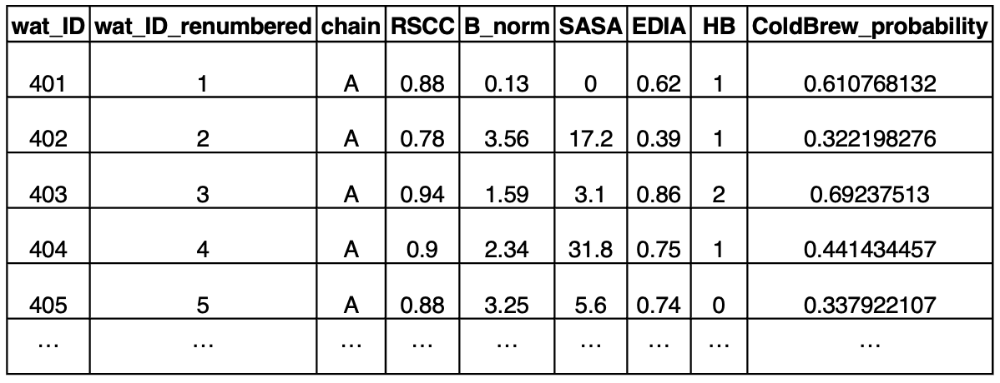
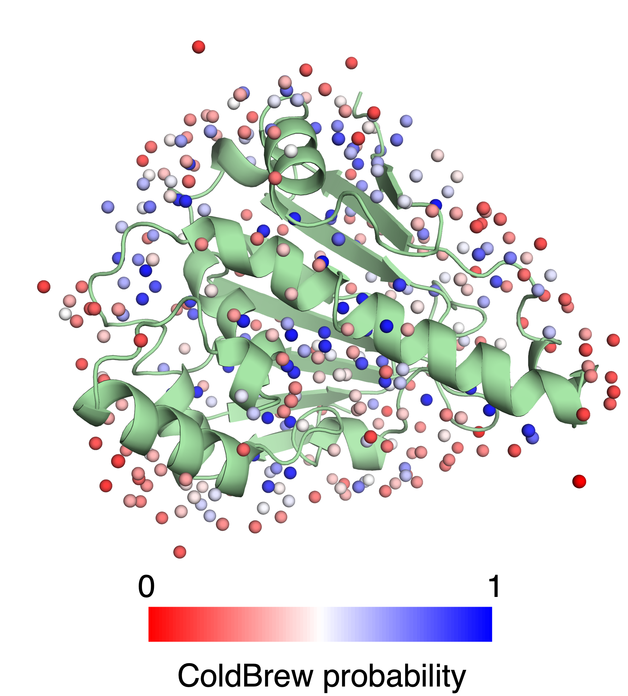
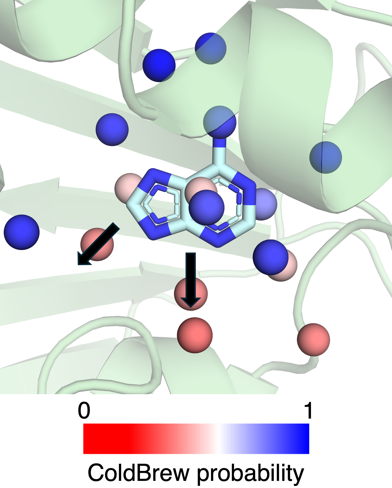

# ColdBrew


A method to predict whether water molecules in cryogenic crystal structures will also be present at room temperature. The ColdBrew probability also serves as a simple experimental proxy of water displaceability for ligand discovery.

## Background

Structural knowledge of proteins can provide crucial insights for ligand discovery. Such insights into the fine detail of interactions between protein, ligand, and water can be obtained from high-resolution structures determined using X-ray crystallography.

Despite the importance, the presence and positioning of water networks in crystal structures are uncertain. This is further complicated when considering that about 95% of crystal structures were solved at cryogenic (cryo) temperatures, which often results in the presence of additional water molecules that are artificially stabilized by the cryogenic temperature.

These mismodeling or omissions of water networks affect our structural interpretation and potentially mislead medicinal chemistry efforts. To improve the interpretation of water networks, we developed ColdBrew--a method that links water stability to ligand discovery.

We trained a random forest model to predict whether water molecules in cryogenic structures will be present at room temperature (RT) using a set of 242 matched cryo-RT pairs. The result is the ColdBrew probability, which is the probability between 0 and 1 for the cryo water to appear at RT.

To link this metric to ligand discovery, we examined >1 million waters and found that the ColdBrew probability correlated with the binding locations of various ligands. We also found, using molecular dynamics (MD) grid inhomogeneous solvation theory (GIST) simulations, a correlation between ColdBrew probability and energy.

Our results suggest that ColdBrew can provide a roadmap for optimizing small molecules that bind to proteins. See the section **How to interpret the results** for more information on how to use the method.

**Note:** Pre-calculated ColdBrew probabilities for PDB structures (up to September 2024) are available at the following link: [download](https://zenodo.org/records/13909324)

## Inputs and outputs

### Inputs
- **PDB file of cryogenic crystal structure containing waters**  
  A Protein Data Bank (PDB) file representing the atomic coordinates of the cryo structure. This structure should include explicit water molecules, which are important for subsequent analysis.  

- **MTZ file (reflection data)**  
  A crystallographic reflection file in MTZ format, containing experimental structure factor amplitudes (e.g., 'Fobs') and their associated uncertainties ('sigFobs').

- **CCP4 map file**  
  A precomputed electron density map in CCP4 format, which can be generated, e.g.,  using 'phenix.maps' from the MTZ file.

### Outputs
- **PDB file with ColdBrew probability in B-factor column**  
  A modified PDB file where the B-factor column contains ColdBrew probabilities for each water molecule.
  ```/path/to/output_directory/<ID>_ColdBrew_probability.pdb```

- **CSV file with per-water metrics and ColdBrew probabilities**  
  A table containing all computed metrics and ColdBrew probabilities for each water molecule.
  ```/path/to/output_directory/<ID>_ColdBrew_results.csv```

- **Raw data files from each program**  
  Intermediate output files generated by the various crystallographic tools used in the workflow.
  ```/path/to/output_directory/raw_data_files```

- **Parsed water PDB files with per-water metrics in B-factor column**  
  PDB files where specific metrics for each water molecule are encoded in the B-factor column.
  ```/path/to/output_directory/parsed_data_files```

- **Log files for each calculation**  
  Text files containing warnings, errors, and other messages specific to each program run.  

## Installation and setup

### Prerequisites
1. **Required Python modules:** 
   - pandas
   - biopandas
   - joblib
   - sklearn
3. **External programs required for calculations:**
   - PyMOL: [download](https://www.pymol.org)
   - Phenix: [download](https://phenix-online.org/download)
   - naccess: [download](http://www.bioinf.manchester.ac.uk/naccess)
   - HBPLUS: [download](https://sbgrid.org/software/titles/hbplus)
   - ediascorer: [download](https://software.zbh.uni-hamburg.de/static/getPackage)

### Steps
1. **Install python modules listed above.**
2. **Install the above software according to the external instructions.**
3. **Set the following environment variables for the outside program executables from the command line:**
   - *PyMOL executable*: "export PYMOL_EXE=/path/to/pymol/executable"
   - *phenix bin*: "export PHENIX_BIN=/path/to/phenix/bin"
   - *naccess executable*: "export NACCESS_EXE=/path/to/naccess/executable"
   - *HBPLUS executable*: "export HBPLUS_EXE=/path/to/HBPLUS/executable"
   - *ediascorer executable*: "export EDIASCORER_EXE=/path/to/ediascorer/executable"
   - *ediascorer license* (obtained upon download of the external software): "export EDIASCORER_LICENSE=string_edia_license"

Note: The ColdBrew program itself requires no additional installation once the above steps for setting up external software have been completed.
The code has been tested using the following software versions: PyMOL 2.5.0, Phenix 1.20.1, Naccess 2.1.1, HBPLUS 3.2, and EDIAScorer 1.1.0 for both intel and mac M1.

## Usage

### Command
To run the program, run the following command:
```python /path/to/run_coldbrew.py -pdb /path/to/input.pdb -ccp4 /path/to/input_map.ccp4 -mtz /path/to/input.mtz -o /path/to/output_directory```

### Arguments

The following arguments are required for each run:
- ```-pdb```: Path to the input PDB file (cryo crystal structure containing water molecules).
- ```-ccp4```: Path to the CCP4 map file.
- ```-mtz```: Path to the MTZ file containing structure factor data.
- ```-o```:  Path to the output directory where results will be saved.

### Notes on output
- The program will use an ID based on pdb file name (the string except '.pdb') for output files (denoted as ```<ID>```).
- Output files can be found in the output directory provided by the user.
- Raw datafiles can be found in ```/path/to/output_directory/raw_data_files```.
- Parsed datafiles can be found in ```/path/to/output_directory/parsed_data_files```.
- The main output files are ```/path/to/output_directory/<ID>_ColdBrew_probability.pdb``` and ```/path/to/output_directory/<ID>_ColdBrew_results.csv``` (more information in the following section).
- Keep in mind that the exact value of the ColdBrew probability may change slightly depending on experimental data processing, compiler, or versions of the softwares.
- If the value is -1, this means that the CCP4 map was not large enough. Try providing a larger map or simply ignore that water.

## How to interpret the results 

In this section, consider the example of apo Hsp90&#945; (6GPW), as shown in the manuscript. We will also look at an adenine-bound structure (2YED).

We have also provided a demo for this example (see README in demo directory for instructions on how to run). For reference, this example should complete in less than a minute (~30 seconds).

### Want to use the ColdBrew probability and calculated metrics?
If you want to know values for a specific water, look at the CSV file (```/path/to/output_directory/<ID>_ColdBrew_results.csv```). From here, you can see the ColdBrew probability, as well as the individual metrics (features of the model), for any water molecule. The ```wat_ID``` numbering is based on the input pdb and ```wat_ID_renumbered``` is a renumbered version 1 through N where N is the number of water molecules.



### Want to visualize the predicted RT water network?
To visualize the predicted RT water network, load the PDB file (```/path/to/output_directory/<ID>_ColdBrew_probability.pdb```) in your favorite biomolecular visualization software (e.g., PyMOL) and color the water network based on the B-factor column (contains ColdBrew probabilities).



### Want to use ColdBrew probability for ligand discovery?
For ligand design, first, color the water network, as mentioned above, and zoom in on the binding site. The ColdBrew probability of the water network surrounding the ligand or binding site can provide a roadmap for designing ligands. Because ligands typically avoid high probability waters, try to build the ligand in the direction of lower probability waters. However, high probability waters can be displaced if the ligand can interact similrly with the protein, as noted in the manuscript.

In the example below, we show a known binder (adenine) overlayed on the apo Hsp90&#945; structure. If branching off of the adenine molecule, there are two viable paths that avoid high probability waters, denoted with arrows. In this example, ligands do indeed bind in the two paths.




## License  

This project is licensed under the [GNU General Public License (GPL) v3](./LICENSE).

See the LICENSE file in the repository for more details.

## Citation

TBD